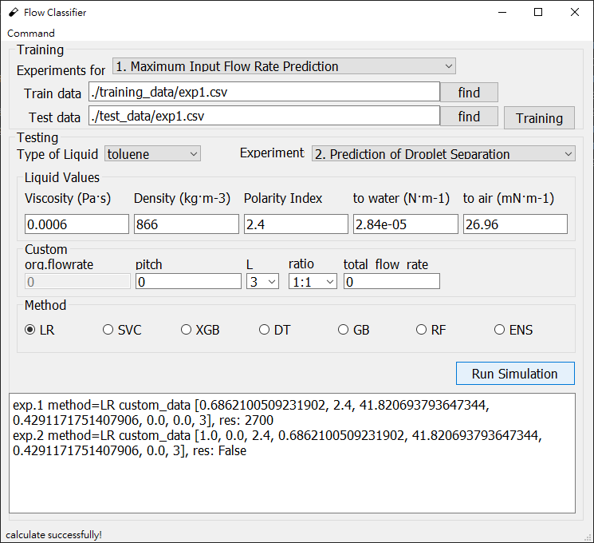

# BiphasicFlowClassifier
GUI of Machine Learning which is for Biphasic Flow Classifier (Two-Phase Flow Classifier)
 

# Install Python packages
please refer to the file requirements.txt

# Run the Python script
if you already have installed python interpretor and such python packages as mentioned above

you run the GUI by
`python gui_qt.py`

# Testing the model
you obtain 2 kind results with different types (number or True/False) while choosing different experiments

there are 2 experiments so far
- 1. Maximum Input Flow Rate Prediction
- 2. Prediction of Droplet Separation
        

# Training your own dataset
prepare .csv data, you should obey the format of .csv files in folder training_data and test_data

you may replace the .csv files because the default paths just is them that you train without choosing .csv files again

# Make an executable file
you use pyinstaller to build a .exe file

please refer to the file pyinstaller.txt

once you build a `dist_XXXX_XX_XX` folder, you may copy folder `record, result, test_data, training_data`, and the file `gui.bat` to the folder, you can just click `gui.bat` to execute the GUI